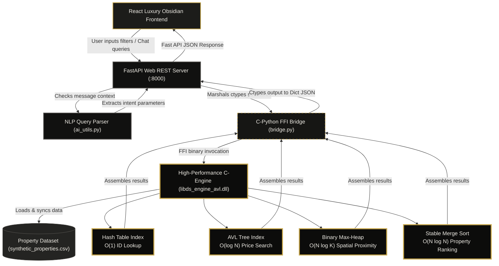

# PropNexus: AI-Powered Spatial Search Engine

**PropNexus** is a full-stack smart property search system built for efficient real-estate listing retrieval. The core search engine is implemented in C using data structures such as hash tables or tree-based indexing for fast lookup, filtering, sorting, ranking, and spatial querying, while FastAPI powers the backend, React provides the frontend, and AI adds natural-language assistance and result explanations.

## 🔄 System Architecture & Workflow



## 🚀 Key Features
- **AVL Tree Indexing**: Efficient price-based range search in $O(\log N + K)$.
- **ID Hash Table**: Instant $O(1)$ property lookups by ID.
- **Merge Sort Engine**: Stable, high-speed ranking and filtering of property results.
- **Min-Heap Ranking**: Efficient Top-K nearest property retrieval.
- **Hybrid Gen-AI Engine**: 
  - **NLP Search**: Describe properties in plain English (e.g., "3BHK in Gachibowli under 2Cr").
  - **Expert Chatbot**: Personalized property recommendations based on your query context.
  - **Local RAG Fallback**: Robust knowledge retrieval system that ensures the assistant stays smart even if external APIs are down.
- **Premium Frontend**: Modern, high-performance dashboard built with React and custom-tuned CSS for a seamless user experience.

## 📁 Project Structure
```text
PropNexus/
├── backend/            # Python & C Logic
│   ├── core/           # C High-Performance Engine
│   │   ├── ds_core.h       # Structural blueprint & FFI definitions
│   │   ├── ds_hash_sort.c  # ID Indexing & Merge Sort logic
│   │   └── ds_spatial_heap.c # AVL Tree & Min-Heap logic
│   ├── data/           # Property datasets (CSV/Binary)
│   ├── scripts/        # Build and smoke test scripts
│   ├── main.py         # FastAPI REST Endpoints
│   └── bridge.py       # C-Python FFI Wrapper
└── frontend/           # React Application (Vite)
    ├── src/            # Components & App Logic
    ├── public/         # Static Assets
    └── index.html      # Entry Point
```

## 🛠️ Installation & Setup

### 1. Requirements
- **Compiler**: GCC (MinGW-w64 recommended for 64-bit Windows)
- **Runtime**: Python 3.14+, Node.js 18+
- **Environment**: 64-bit OS matching your Python/Compiler bitness

### 2. Build the C Engine
Navigate to the root and run the automated build script:
```powershell
cd backend
powershell -ExecutionPolicy Bypass -File scripts/build.ps1
```

### 3. Start the Backend API
Install dependencies and launch the FastAPI server:
```bash
cd backend
pip install -r requirements.txt
uvicorn main:app --reload
```

### 4. Start the Frontend Dashboard
Navigate to the frontend directory and launch the Vite dev server:
```bash
cd frontend
npm install
npm run dev
```

## 🧠 Data Structure Complexity Note
| Operation | Data Structure | Complexity |
| :--- | :--- | :--- |
| **ID Lookup** | Hash Table (Chaining) | $O(1)$ Average |
| **Price Search** | AVL Tree | $O(\log N + K)$ |
| **Top-K Ranking** | Binary Min-Heap | $O(N \log K)$ |
| **Result Sorting** | Merge Sort | $O(N \log N)$ |
| **AI Matching** | Hybrid (NLP + RAG) | $O(\text{Embedding/Keyword Search})$ |

## 🌟 Recent Updates (v3.0)
- **Luxury Obsidian & Gold Redesign**: Overhauled the entire visual theme inspired by Christie's Real Estate, using layers of deep obsidian surfaces, elegant typography, and a unified gold-accent styling.
- **Framer Motion v11 Transitions**: Added smooth staggers on property grid viewport entry, floating logo micro-animations, slow-drift gradient orbs behind the search card, and responsive active filter badge pops.
- **High-Fidelity Property Detail Modal**: Implemented interactive property cards opening into a rich overlay detail view equipped with full unsplash imagery, C-Engine stats, local location tagging, and elegant tactile CTAs.
- **Chatbot Intent Mapping & View actions**: The AI chatbot now detects query search intent to instantly extract matching property cards from the C-engine. Recommend cards support a "View" button that dismisses the chatbot and displays the property detail modal.
- **Unified Query Parser & Descending Price Sort**: Integrated local sub-millisecond price-descending ranking alongside standard AVL range queries.

---
*Created as a Data Structures Semester Project.*
